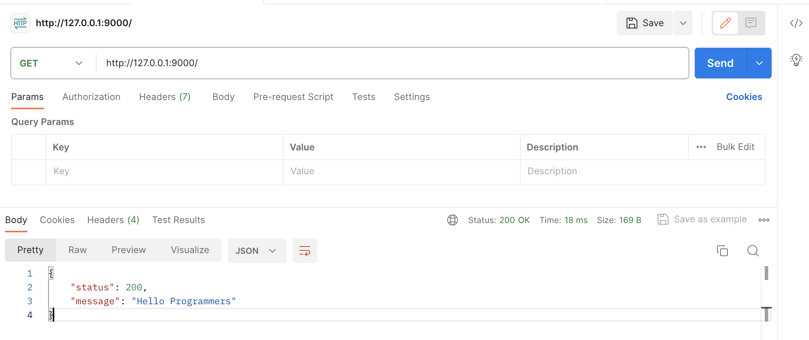
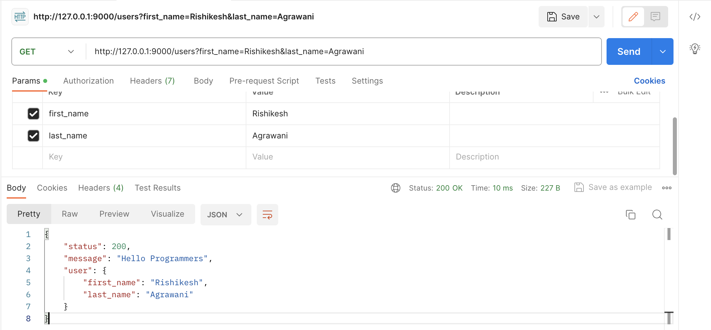
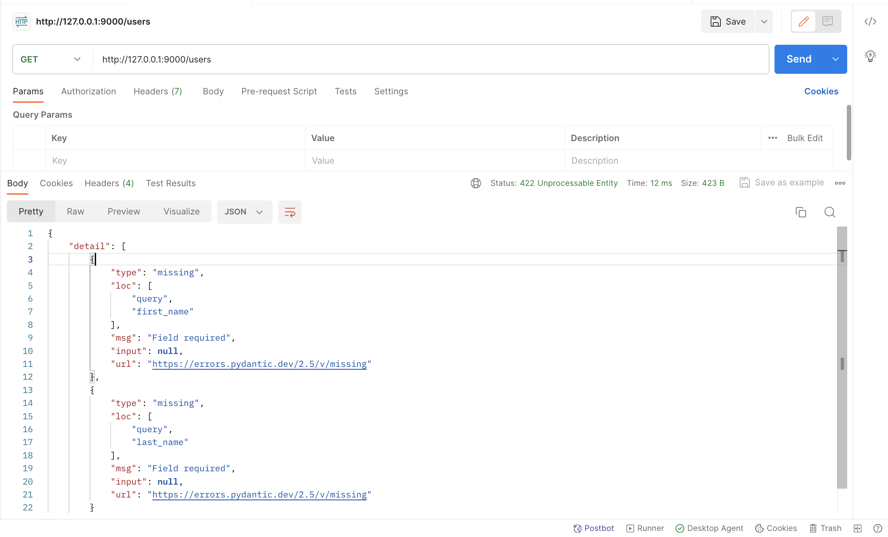
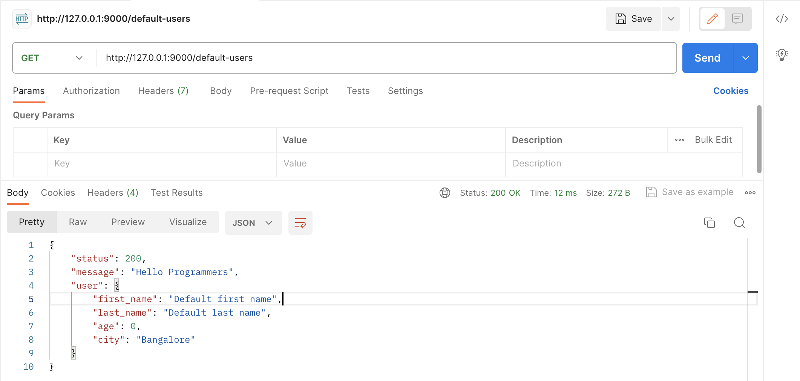
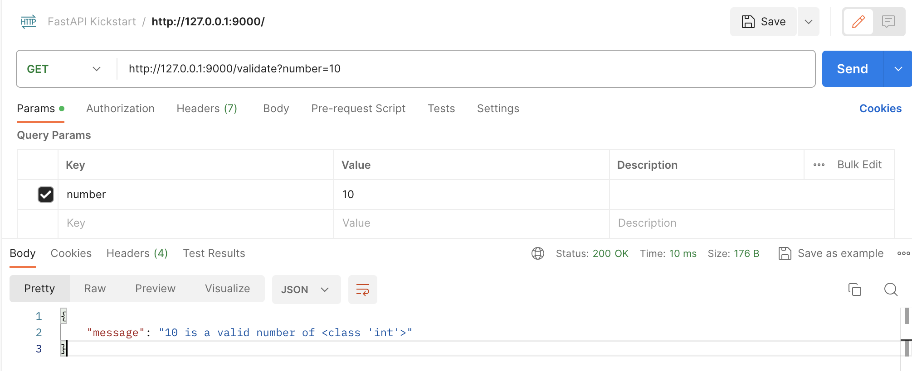
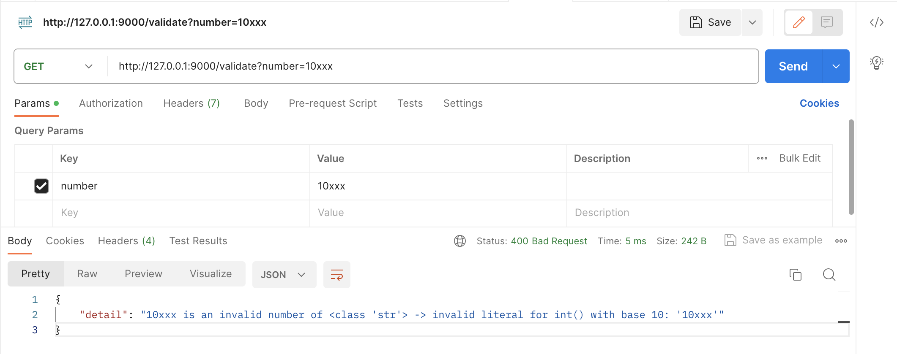
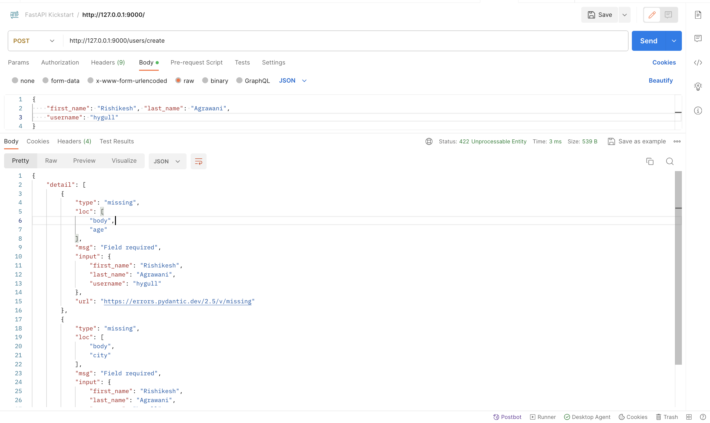
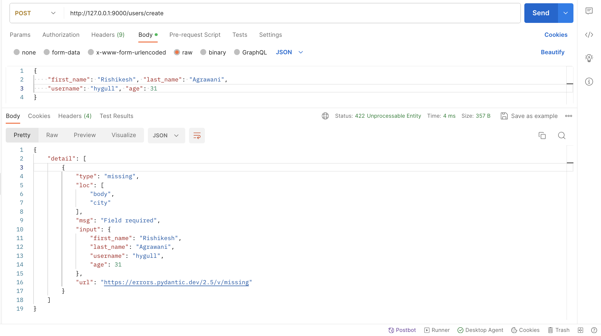

# fastapi-kickstart-guide
A repository which contains beautiful notes and steps which can help beginners of FastAPI to kickstart with the FastAPI very faster. It contains bunch of beautiful examples, learning notes, references etc. Images have been attached too. The README.md will help any newbies to FastAPI learn the things faster and better.

## List of contents

1. [Cloning newly created Github project and dependencies installation inside virtualenv](./resources/docs/01_virtualenv_and_dependencies_installations.md)
2. [Create main application file, write starter endpoint and run server](./resources/docs/02_create_main_application_file_and_runserver.md)

---

**Create `main.py` with below code snippet**

```python
from fastapi import FastAPI


app = FastAPI()

@app.get('/')
def hello_programmers():
    return {
        "status": 200,
        "message": "Hello Programmers"
    }
```
---

> **Run the app server**
>
> By default it runs on port `8000` (Here I am running on a custom port `9000`)

`uvicorn main:app --reload --port 9000`



---

**Query Parameters**

```python
from fastapi import FastAPI


app = FastAPI()

@app.get('/users')
def hello_programmers(
        first_name: str,
        last_name: str
    ):
    return {
        "status": 200,
        "message": "Hello Programmers",
        "user": {
            "first_name": first_name,
            "last_name": last_name
        }
    }
```

-> Query Parameters



-> Required Query Parameters (Automatic validations)


---

**Query Parameters with default values**

```python
from fastapi import FastAPI


app = FastAPI()

@app.get('/default-users')
def hello_programmers(
        first_name: str = 'Default first name',
        last_name: str = "Default last name",
        age: int = 0,
        city: str = 'Bangalore'
    ):
    return {
        "status": 200,
        "message": "Hello Programmers",
        "user": {
            "first_name": first_name,
            "last_name": last_name,
            "age": age,
            "city": city
        }
    }
```

-> Query parameters with default values



---

**Handing Exceptions**

```python
from fastapi import FastAPI, HTTPException


app = FastAPI()

@app.get('/validate')
def validate_integer_numbers(
        number: str
    ):
    try:
        number = float(number) if '.' in number else int(number)
        return {
            "message": f"{number} is a valid number of {type(number)}"
        } 
    except Exception as error:
        raise HTTPException(status_code=400, detail=f"{number} is a invalid number of {type(number)} -> {error}")
```

-> Handing Exceptions - valid response 


---
Handing Exceptions - Invalid response 


---

**Pydantic Model for Input validation**

```python
from fastapi import FastAPI
from pydantic import BaseModel


class User(BaseModel):
    first_name: str
    last_name: str
    full_name: str = '' # Skipping this entry will raise `ValueError: "User" object has no field "full_name" inside endpoint while setting -> user.full_name` 
    username: str
    age: int
    city: str

@app.post("/users/create/")
def create_user(
        user: User
    ):
    user.full_name = f"{user.first_name} {user.last_name}"
    return user
```
-> 2 fields are missing in the POST body



-> 1 field is missing in the POST body



-> All fields are being passed in the POST body


---

## References

[How to run FastAPI app on a custom port](https://www.slingacademy.com/article/how-to-run-fastapi-on-a-custom-port/)
[How to extract Query parameters in FastAPI](https://www.slingacademy.com/article/how-to-extract-query-parameters-in-fastapi/)

## Error Patterns

- A Database error occurred (If VPN ic not connected, Net is slow).
- Detail not found (If wrong FastAPI app is running and we are hitting the API).