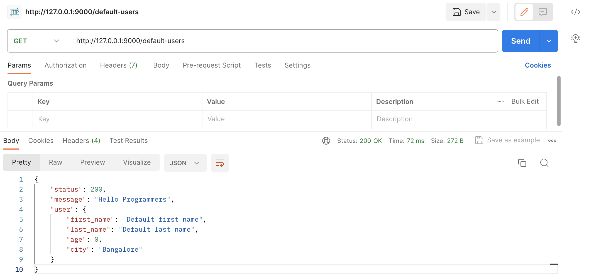

# fastapi-kickstart-guide
A repository which contains beautiful notes and steps which can help beginners of FastAPI to kickstart with the FastAPI very faster. It contains bunch of beautiful examples, learning notes, references etc. Images have been attached too. The README.md will help any newbies to FastAPI learn the things faster and better.

## List of contents

1. [Cloning newly created Github project and dependencies installation inside virtualenv](./resources/docs/01_virtualenv_and_dependencies_installations.md)
2. [Create main application file, write starter endpoint and run server](./resources/docs/02_create_main_application_file_and_runserver.md)

---

**Create `main.py` with below code snippet**

```python
from fastapi import FastAPI


app = FastAPI()

@app.get('/')
def hello_programmers():
    return {
        "status": 200,
        "message": "Hello Programmers"
    }
```
---

> **Run the app server**
>
> By default it runs on port `8000` (Here I am running on a custom port `9000`)

`uvicorn main:app --reload --port 9000`


---

**Query Parameters**

```python
from fastapi import FastAPI


app = FastAPI()

@app.get('/users')
def hello_programmers(
        first_name: str,
        last_name: str
    ):
    return {
        "status": 200,
        "message": "Hello Programmers",
        "user": {
            "first_name": first_name,
            "last_name": last_name
        }
    }
```

-> Query Parameters


-> Required Query Parameters (Automatic validations)


---

**Query Parameters with default values**

```python
from fastapi import FastAPI


app = FastAPI()

@app.get('/default-users')
def hello_programmers(
        first_name: str = 'Default first name',
        last_name: str = "Default last name",
        age: int = 0,
        city: str = 'Bangalore'
    ):
    return {
        "status": 200,
        "message": "Hello Programmers",
        "user": {
            "first_name": first_name,
            "last_name": last_name,
            "age": age,
            "city": city
        }
    }
```

-> Query parameters with default values



---

**Handing Exceptions**

```python
from fastapi import FastAPI, HTTPException


app = FastAPI()

@app.get('/validate')
def validate_integer_numbers(
        number: str
    ):
    try:
        number = float(number) if '.' in number else int(number)
        return {
            "message": f"{number} is a valid number of {type(number)}"
        } 
    except Exception as error:
        raise HTTPException(status_code=400, detail=f"{number} is an invalid number of {type(number)} -> {error}")
```

-> Handing Exceptions - valid response 


---
Handing Exceptions - Invalid response 


---

**Pydantic Model for Input validation**

```python
from fastapi import FastAPI
from pydantic import BaseModel


class User(BaseModel):
    first_name: str
    last_name: str
    full_name: str = '' # Skipping this entry will raise `ValueError: "User" object has no field "full_name" inside endpoint while setting -> user.full_name` 
    username: str
    age: int
    city: str

@app.post("/users/create/")
def create_user(
        user: User
    ):
    user.full_name = f"{user.first_name} {user.last_name}"
    return user
```
-> 2 fields are missing in the POST body


-> 1 field is missing in the POST body


-> All the fields are being passed in the POST body (full_name field is optional with default value `''` i.e. blank string)


---

**Nested POST Body**

> Note: Here I have considered `blocks` as `no_of_blocks` and not the actual block instances. 

```python
from fastapi import FastAPI
from pydantic import BaseModel


class State(BaseModel):
    name: str
    blocks: int
    pincode: int

class City(BaseModel):
    name: str
    state: State
    population: int
    pincode: int

@app.post("/cities/create")
def create_city(
        city: City
    ):
    return city
```

-> Nested POST body: State is nested inside City


---

**POST body with List of objects**

```python
from fastapi import FastAPI
from typing import List


class Fruit(BaseModel):
    name: str 
    colour: str

class Tree(BaseModel):
    name: str
    branches: int
    leaves: int
    fruits: List[Fruit]

@app.post("/trees/create")
def create_tree(
        tree: Tree
    ):
    return tree
```

-> POST body with list of objects (List of Fruits objects inside the Tree object)


---

**Using Enum for input validation**

```python
class FruitName(str, Enum):
    default = 'fruit'
    favourite = 'favourite fruit'
    healthy = 'healthy fruit'


@app.post('/fruits/create')
def create_fruit(
        name: str, 
        nickname: FruitName
    ):
    return {
        "fruit": {
            "name": name,
            "nickname": nickname
        }
    }
```

-> If wrong value is passed for Enum data type


-> If correct values are passed for Enum data type


---

**Using Enum and Pydantic Model together**

```python
class PlatformType(str, Enum):
    search_engine = 'Search Engine'
    social_media = 'Social Media'


class PlatformInfo(BaseModel):
    name: str 
    type: PlatformType
    nickname: str


class Platform(Enum):
    instagram = PlatformInfo(
        name="Instagram", 
        type=PlatformType.social_media, 
        nickname=f'Instagram {PlatformType.social_media.value}'
    )
    facebook = PlatformInfo(
        name="Facebook", 
        type=PlatformType.social_media, 
        nickname=f'Facebook {PlatformType.social_media.value}'
    )
    google = PlatformInfo(
        name="Google", 
        type=PlatformType.search_engine, 
        nickname=f'Google {PlatformType.search_engine.value}'
    )

class PlatformRequest(BaseModel):
    platform: str


@app.post("/platforms/create")
def create_platform(
        platform_request: PlatformRequest
    ):
    try:
        platform = Platform[platform_request.platform].value.dict()
    except KeyError as error:
        # Order is status_code, detail -> if you do not specify kwarg names then using 
        #   `raise HTTPException(f'Invalid key {platform_request.platform}', status_code=400)`
        # will throw
        #   `TypeError: HTTPException.__init__() got multiple values for argument 'status_code'`
        raise HTTPException(
            detail=f'Invalid key {platform_request.platform}', 
            status_code=400
        ) 

    return {
        "platform": platform
    }
```

-> Using Enum and Pydantic Model together


---

**Installing Custom Exceptions: Customising Exceptions**

```python
from fastapi import FastAPI, HTTPException
from fastapi.responses import JSONResponse
from fastapi.requests import Request


# Install custom exceptions
class CustomFastAPIHttpException(HTTPException):
    def __init__(self, status_code: str, detail: str, custom_message: str):
        '''
            In case we skip -> `super().__init__(status_code=status_code, detail=detail)`
            We will see:
                `AttributeError: 'CustomFastAPIHttpException' object has no attribute 'status_code'`
        '''
        super().__init__(status_code=status_code, detail=detail)
        self.custom_message = custom_message


@app.exception_handler(CustomFastAPIHttpException)
async def custom_exception_handler(
    request: Request,
    exception: CustomFastAPIHttpException
):
    return JSONResponse(
        status_code=exception.status_code,
        content= {
            "message": "Something went wrong!",
            "custom_message": exception.custom_message,
            "detail": exception.detail  
        }
    )


@app.get("/plans/")
def get_plans(count: int):
    try:
        assert count != 0, "Plans count should be > 0"
        return {
            "plans": [
                { 
                    "name": f"Plan {plan_no}", 
                    "created_at": datetime.now(),
                    "updated_at": datetime.now()
                }
                for plan_no in range(1, count + 1)
            ]
        }
    except Exception as error:
        raise CustomFastAPIHttpException(
            status_code=400,
            detail=f'There is some issue while processing the request -> {error}',
            custom_message='Please check, this might be due to wrong input or code BUG.'
        )
```

-> Simple Plans list example using custom exceptions 


-> Customising the exception message (Throw custom error message)


---

**Using Union from typing**

```python
from fastapi import FastAPI
from typing import Union

app = FastAPI(app)


class Item(BaseModel):
    name: str
    nickname: Union[str, None] = None
    price: Union[int, float] = 0


@app.post("/items/")
async def create_item(
    item: Item
):
    return {
        "item": item
    }
```

-> Using Union from typing module (Default nickname & price) - str or None & int or float 


-> Using Union from typing module (All values)


---

### Error Patterns

- A Database error occurred (If VPN is not connected OR internet is too slow).
- Detail not found (If wrong FastAPI app is running and we are hitting the API).
- Internal Server Error (Not handling an exception inside the endpoint function throws this).
- If you got this error by calling handler(<some type>) within `__get_pydantic_core_schema__` then you likely need to call `handler.generate_schema(<some type>)` since we do not call `__get_pydantic_core_schema__` on `<some type>` otherwise to avoid infinite recursion (If you define `price: [int, float] = 0` instead of `price: Union[int, float] = 0` inside Pydantic class)

### Notes 

- Not returning anything from endpoint returns null response.
- Raising an HttpException returns a response with detail in FastAPI
- Returning a BaseModel instance returns a JSON response in FastAPI 

### API/FastAPI specific keywords

- Path 
- Route
- Route definition
- Endpoint
- HTTP method/verb
- Path parameters
- Query parameters
- Body parameters
- Dependency Injection

### ChatGPT Notes

- [How to connect to DB in FastAPI?](./resources/docs/chatgpt_notes/db_connection.md)
- [How to perform CRUD operations using FastAPI?](./resources/docs/chatgpt_notes/crud_operations.md)

### References

- [How to run FastAPI app on a custom port](https://www.slingacademy.com/article/how-to-run-fastapi-on-a-custom-port/)
- [How to extract Query parameters in FastAPI](https://www.slingacademy.com/article/how-to-extract-query-parameters-in-fastapi/)
- [Handling exceptions](https://fastapi.tiangolo.com/tutorial/handling-errors/)
- [Real Python - FastAPI Python Web APIs](https://realpython.com/fastapi-python-web-apis/)
- [FastAPI - Excellent examples](https://devdocs.io/fastapi/)
- [FastAPI Tutirial in Visual Studio Code](https://code.visualstudio.com/docs/python/tutorial-fastapi)
